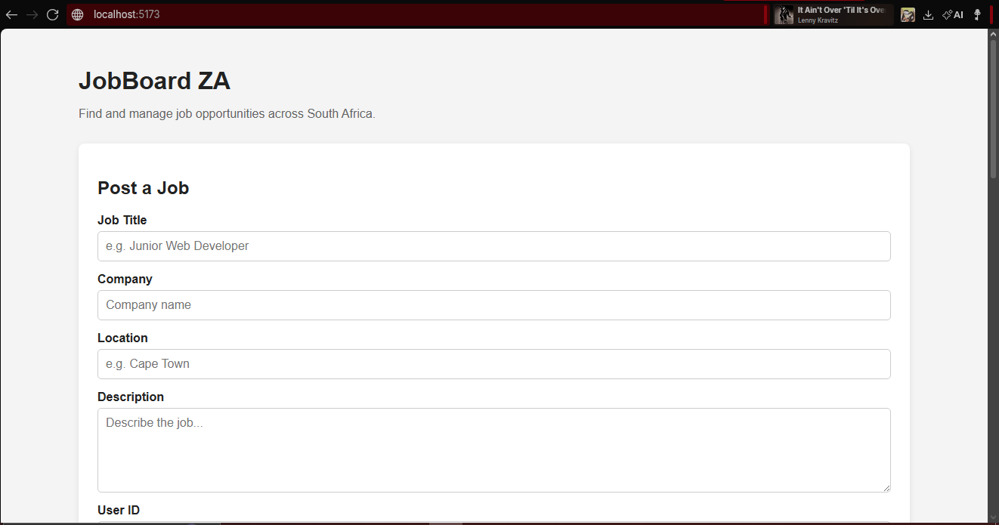

# JobBoard ZA

## Description

JobBoard ZA is a full-stack job board application that allows users to browse, search, create, update, and delete job listings. The application uses a Vue 3 frontend connected to a Node.js and Express backend API with MySQL for persistent data storage.

## Tech Stack

- **Vue 3** - Used to build the interactive frontend user interface.
- **Vite** - Used as the frontend development server and build tool.
- **Axios** - Used to send HTTP requests from the Vue frontend to the backend API.
- **Node.js** - Used to run the backend JavaScript application.
- **Express.js** - Used to create the REST API and handle HTTP requests.
- **MySQL** - Used to store jobs and related application data.
- **mysql2** - Used to connect the Node.js backend to MySQL.
- **CSS** - Used to style the application and provide responsive layouts.

## Prerequisites

Before running the project, make sure the following are installed:

- Node.js
- npm
- MySQL
- A modern web browser

MySQL must be running on port `3307`.

## Environment Variables

Create a `.env` file in the backend directory.

Example:

```env
DB_HOST=localhost
DB_USER=root
DB_PASSWORD=
DB_NAME=jobboard_za
DB_PORT=3307 (must be setup on this port)
PORT=3000
```

## Database Setup

Create the JobBoard ZA database in MySQL:

```CREATE DATABASE jobboard_za;

USE jobboard_za;
```

## Installation

Clone this repo

```
git clone https://github.com/LiamDeWet/LCA-JobBoard-ZA.git
```

Then move into project folder

```
cd LCA-JobBoard-ZA

```

Go into the respective folders (backend or frontend) and run:

```
npm install

```

For the backend startup run:

```
npm start

```

For frontend startup run:

```
npm run dev

```

## Frontend Features

- Display all available jobs
- Search jobs by supported search criteria
- Create new job listings
- Edit existing job listings
- Delete job listings
- Delete confirmation
- Form validation
- Loading states
- Error handling
- Success feedback
- Automatic list refresh after creating, e - diting, or deleting jobs
- Responsive layout
- No full-page reload required for CRUD operations

## Screenshot



## Author Liam De Wet
